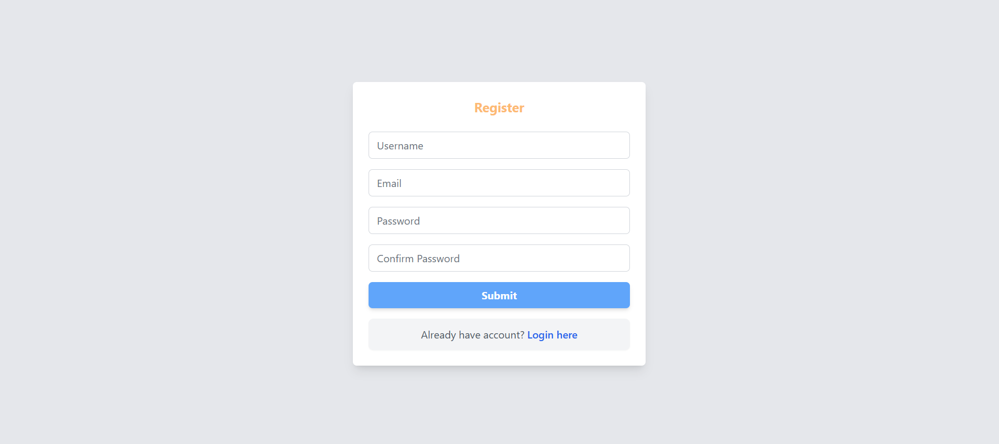

# Todo App

A full-stack **Todo application** built with **ReactJS** (frontend) and **Spring Boot** (backend). This app allows users to manage tasks with features like creating, editing, deleting, and sorting tasks. It also includes **user authentication** and **profile management** for a seamless experience. Designed for **simplicity and efficiency**, it features a **modern UI**, a robust **RESTful API**, and **API documentation using Swagger**.

---

## Table of Contents

- [Features](#features)
  - [User Authentication](#1-user-authentication)
  - [Task Management](#2-task-management)
  - [Profile Management](#3-profile-management)
  - [Responsive UI](#4-responsive-ui)
  - [API Documentation](#5-api-documentation)
  - [Testing Support](#6-testing-support)
- [Tech Stack](#tech-stack)
  - [Frontend](#frontend)
  - [Backend](#backend)
  - [Database](#database)
  - [Build Tools](#build-tools)
- [Prerequisites](#prerequisites)
- [Installation](#installation)
  - [Clone the Repository](#1-clone-the-repository)
  - [Project Structure](#2-project-structure)
- [UI Demonstration](#ui-demonstration)
- [API Documentation](#api-documentation)
- [License](#license)

---

## Features

### 1. User Authentication
- Register and log in using **email and password**

### 2. Task Management
- **CRUD Operations**: Create, edit, and delete tasks
- **Sorting & Pagination**: View tasks sorted by **start date, due date, or status**
- **Task Statuses**:
  - 🟡 `PENDING` – Task is yet to be started
  - 🔵 `DOING` – Task is in progress
  - ✅ `DONE` – Task is completed

### 3. Profile Management
- Update username and email
- Delete account

### 4. Responsive UI
- **Modern design** using **Tailwind CSS**
- Fully **mobile-friendly**

### 5. API Documentation
- Implemented **Swagger UI** for easy API testing and documentation
- Accessible at `/swagger-ui.html` when the backend is running

### 6. Testing Support
- **Auto-filled login credentials** for testers

---

## Tech Stack

### Frontend
- **ReactJS** – UI Framework
- **Tailwind CSS** – Styling
- **Headless UI** – UI Components

### Backend
- **Spring Boot** – Backend Framework
- **Spring Security (JWT)** – Authentication & Authorization & Access Token, Refresh Token
- **Spring Data JPA** – Database Integration
- **Swagger** – API Documentation

### Database
- **MySQL** (configurable for other RDBMS)

### Build Tools
- **npm** – Frontend
- **Maven** – Backend

---

## Prerequisites

Before running the project, ensure you have the following installed:

- **Node.js** (v17+)
- **npm** (v8+)
- **Java** (17+)
- **Maven** (v3.6+)
- **MySQL** (v8+)
- **Git**

---

## Installation

### 1. Clone the Repository
```sh
git clone https://github.com/yourusername/todo-app.git
cd todo-app
```

### 2. Project Structure
```sh
todo-app/
│── todo-app/             # Spring Boot Backend
│   ├── src/main/java/com/todoapp
│   ├── src/main/resources/application.properties
│   ├── pom.xml
│── frontend-test/        # ReactJS Frontend
│   ├── src/components/
│   ├── src/pages/
│   ├── src/App.js
│   ├── package.json
└── README.md            # Project Documentation
```

---

## UI Demonstration

Here are some screenshots of the application:

### 1. Login Page


### 2. Register Page


### 3. Profile Page


### 4. Task List View


---

## API Documentation

The backend includes **Swagger UI** for API documentation and testing.

- **Swagger UI URL**: `http://localhost:8080/swagger-ui.html`
- Provides a visual interface to explore the API endpoints
- Automatically generated from the Spring Boot application

---

## License

This project is **open-source** 

